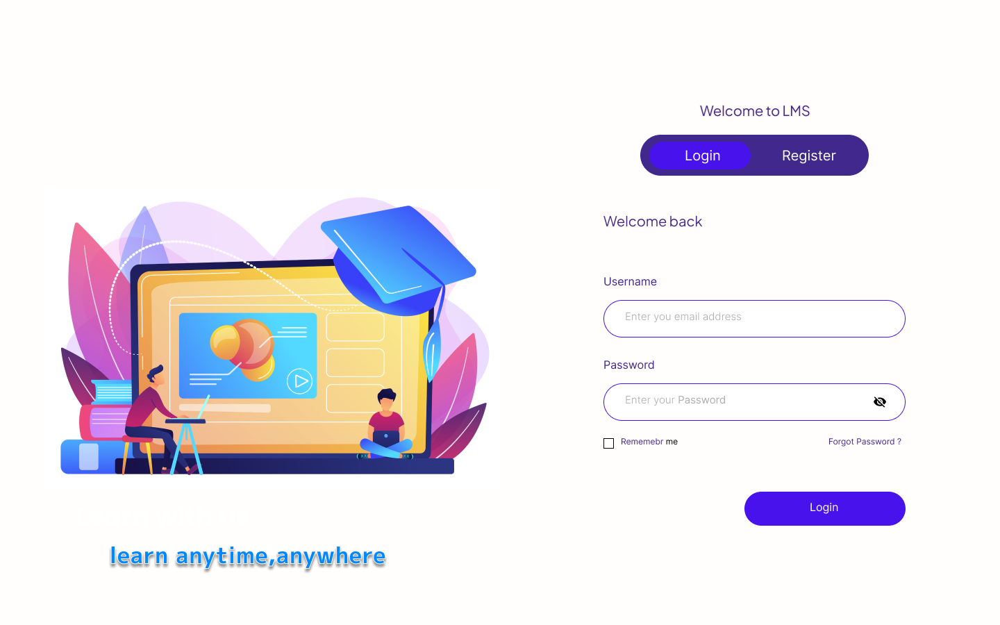
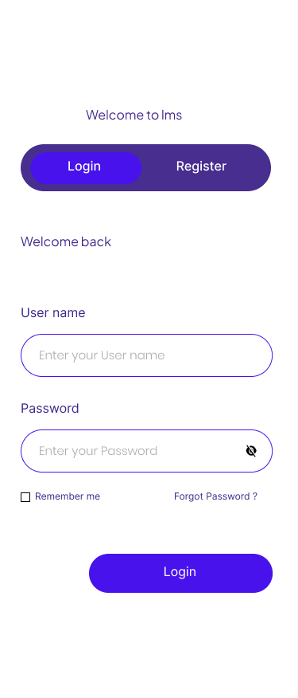

# 🎓 Learning Management System (LMS)

A modern, containerized, full-stack Learning Management System developed with **React (TypeScript)** on the frontend and **Django REST Framework** on the backend, backed by **PostgreSQL** and orchestrated with **Docker Compose**.

This application is built for Brothers IT PLC as a Technical Internship Assessment.

---

## 🎨 Design System & UI Showcase

As a developer and designer, special attention was paid to the visual aesthetics, user experience, and interactive details of this application:

*   **Premium Color Palette**: Standard colors were replaced with curated, modern hues—deep Indigo and Slate dark backgrounds coupled with active Mint accent highlights.
*   **Flicker-Free Dark Mode**: Dark/light mode theme toggling is supported globally (including the Login and Registration pages). A blocking script is injected in the HTML `<head>` to prevent the screen from flashing white when reloading the page.
*   **Responsive Fluid Layouts**: Fully responsive dashboard featuring a collapsible sidebar that turns into a mobile-friendly swipeable bottom-navigation drawer.
*   **Micro-interactions**: Subtle hover scaling, shadow transitions on cards, and clean loading skeletons for async states.

### 📸 Screenshots

| Login Screen (Desktop) | Login Screen (Mobile) |
|:---:|:---:|
|  |  |

| Register Screen (Desktop) | Register Screen (Mobile) |
|:---:|:---:|
|  |  |

---

## 🚀 Quick Start

### Prerequisites
Make sure you have [Docker](https://www.docker.com/) and [Docker Compose](https://docs.docker.com/compose/) installed on your machine.

### Running the Application
1. **Initialize Environments**:
   Copy `.env.example` to `.env` if you want to customize postgres or API base host setups:
   ```bash
   cp .env.example .env
   ```

2. **Start the Docker Services**:
   Spin up the frontend, backend, and database containers in detached mode:
   ```bash
   docker compose up -d
   ```

3. **Apply Database Migrations**:
   Run database migrations to initialize tables and relationships:
   ```bash
   docker compose exec backend python manage.py migrate
   ```

4. **Access Ports**:
   *   **Frontend Client**: [http://localhost:3000](http://localhost:3000)
   *   **Backend REST APIs**: [http://localhost:8000/api](http://localhost:8000/api)
   *   **Django Administrative Panel**: [http://localhost:8000/admin](http://localhost:8000/admin)

---

## 🧪 Testing the APIs & Backend

To run the built-in automated test suite covering registration, JWT auth, instructor restrictions, and enrollment constraints:

```bash
docker compose exec backend python manage.py test
```

---

## 🛠️ Technology Stack

*   **Frontend**: React.js, TypeScript, Tailwind CSS, Redux Toolkit (RTK Query for state & API caching), React Router, Zod (Form schemas).
*   **Backend**: Python, Django, Django REST Framework, SimpleJWT (JSON Web Token authentication).
*   **Database**: PostgreSQL.
*   **DevOps**: Docker, Docker Compose.
*   **Design**: Figma.

---

## 📡 API Reference Specifications

### 🔐 Authentication Module
| Method | Endpoint | Description | Auth Required |
| :--- | :--- | :--- | :--- |
| `POST` | `/api/auth/register` | Register new user (Student / Instructor) | No |
| `POST` | `/api/auth/login` | Login user, returns access & refresh tokens | No |
| `POST` | `/api/auth/refresh` | Obtain a new access token using refresh token | No |
| `GET` | `/api/auth/profile` | Retrieve current authenticated user profile | **Yes (JWT)** |

### 📚 Course Management
| Method | Endpoint | Description | Auth Required |
| :--- | :--- | :--- | :--- |
| `GET` | `/api/courses` | List all courses (supports search and category filters) | **Yes (JWT)** |
| `POST` | `/api/courses` | Create a new course (Instructors only) | **Yes (JWT)** |
| `GET` | `/api/courses/{id}` | Retrieve specific course details | **Yes (JWT)** |
| `PUT` | `/api/courses/{id}` | Update course information (Course owner only) | **Yes (JWT)** |
| `DELETE` | `/api/courses/{id}` | Delete a course (Course owner only) | **Yes (JWT)** |

### 📝 Lesson Management
| Method | Endpoint | Description | Auth Required |
| :--- | :--- | :--- | :--- |
| `GET` | `/api/lessons` | List lessons | **Yes (JWT)** |
| `POST` | `/api/lessons` | Add a new lesson to a course (Instructors only) | **Yes (JWT)** |
| `PUT` | `/api/lessons/{id}` | Edit a lesson details (Course owner only) | **Yes (JWT)** |
| `DELETE` | `/api/lessons/{id}` | Remove a lesson (Course owner only) | **Yes (JWT)** |

### 🎓 Enrollments & Learning Progress
| Method | Endpoint | Description | Auth Required |
| :--- | :--- | :--- | :--- |
| `POST` | `/api/enrollments` | Enroll in a course (Students only; prevents duplicates) | **Yes (JWT)** |
| `GET` | `/api/my-courses` | List courses the logged student is enrolled in | **Yes (JWT)** |
| `POST` | `/api/lesson-progress` | Toggle completion status for a lesson | **Yes (JWT)** |